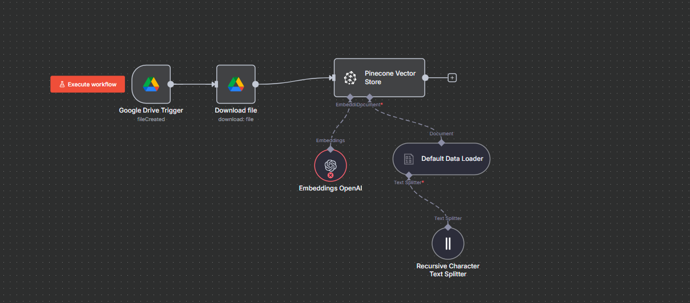

# n8n RAG Workflow for Google Drive Documents

This repository contains an n8n workflow that automatically processes files uploaded to a Google Drive folder, splits the text, generates embeddings using OpenAI, and stores them in a Pinecone vector database for retrieval-augmented generation (RAG) purposes.

---

## Workflow Overview



The workflow performs the following steps:

1. **Google Drive Trigger**  
   Watches a specific folder for new files and triggers the workflow when a file is created.

2. **Download File**  
   Downloads the newly created file from Google Drive.

3. **Recursive Character Text Splitter**  
   Splits the document into smaller chunks (500 characters per chunk, with 200 characters overlap) for efficient processing.

4. **Default Data Loader**  
   Prepares the document data with optional metadata, such as the file name.

5. **Embeddings OpenAI**  
   Generates vector embeddings for each chunk of text using OpenAI API.

6. **Pinecone Vector Store**  
   Inserts the embeddings into a Pinecone index for later retrieval.

---

## Example Google Drive Folder

- Folder URL: [Open Folder](https://drive.google.com/drive/folders/1zZc8yBG5YD4EEgDV0OhY5D3KAMKDtsea)  
- Folder ID: `1zZc8yBG5YD4EEgDV0OhY5D3KAMKDtsea`

---

## n8n Nodes in this Workflow

| Node Name | Description |
|-----------|-------------|
| Google Drive Trigger | Watches for new files in a specific Google Drive folder |
| Download File | Downloads the uploaded file |
| Recursive Character Text Splitter | Splits text into chunks |
| Default Data Loader | Prepares document with metadata |
| Embeddings OpenAI | Generates embeddings using OpenAI |
| Pinecone Vector Store | Stores embeddings into Pinecone |

---

## Setup Instructions

1. **Clone the Repository**

```bash
git clone <repository-url>
cd <repository-folder>
